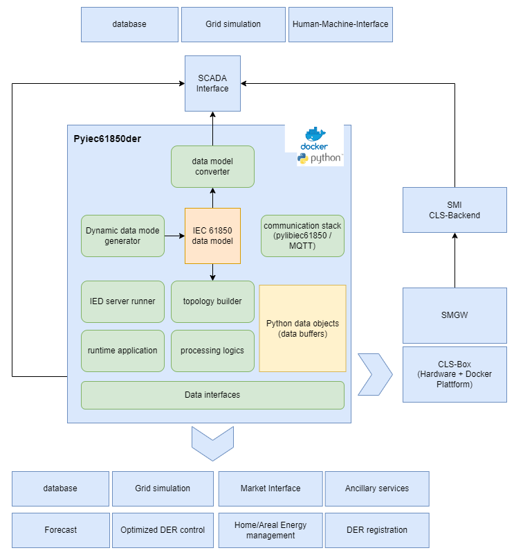
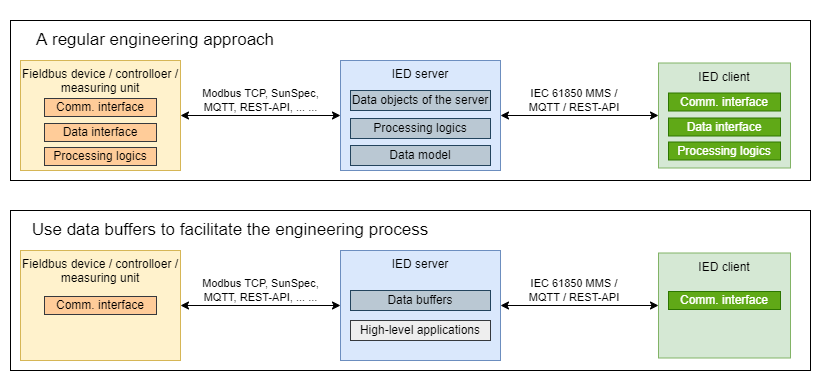

# pyIEC61850DER

Welcome to the project repo of the open-source python library `pyIEC61850DER`. As its name suggests, this projects aims 
at facilitating and stimulating the application of the industrial standard IEC 61850 series in terms of DER integration in distribution grids. This lib could be a central building block for the implementation of intelligent, decentralised, scalable control systems. It can easily be embedded into windows or linux OS for high-level real-time simulation and optimisation applications, the python codes are structured in such a way that the entire package is compliant with container applications.

# Table of Contents

<!-- TOC -->
* [pyIEC61850DER](#pyiec61850der)
* [Table of Contents](#table-of-contents)
* [General Information](#general-information)
  * [Project status](#project-status)
  * [What is pyiec61850der?](#what-is-pyiec61850der)
  * [Why IEC 61850?](#why-iec-61850)
* [Project Structure](#project-structure)
  * [The idea of using the DataBuffer class](#the-idea-of-using-the-databuffer-class)
* [User Guide](#user-guide)
  * [Installation](#installation)
  * [Quick user guide for the vIED on Windows OS](#quick-user-guide-for-the-vied-on-windows-os)
  * [Build the project as a single docker container](#build-the-project-as-a-single-docker-container)
  * [Build the project as a single docker container on Raspberry Pi (64-bit)](#build-the-project-as-a-single-docker-container-on-raspberry-pi-64-bit)
  * [Build the vIED containers in batch for a large scale virtual simulation](#build-the-vied-containers-in-batch-for-a-large-scale-virtual-simulation)
* [Other Information](#other-information)
  * [Known issues and restrictions](#known-issues-and-restrictions)
  * [Data source](#data-source)
  * [Roadmap](#roadmap)
  * [Acknowledgment](#acknowledgment)
  * [Funding](#funding)
* [License](#license)
<!-- TOC -->

<!-- TODO: Split the sections into small files and put them all in ./doc -->

# General Information

## Project status

Now this project is under development and maintenance of the [Smart Grids Research Group](https://studium.hs-ulm.de/de/org/iea/smartgrids) at Ulm University of Applied Sciences in Germany.

If you have any questions or would like to make contribution to this project, be free to contact me: [shuo.chen@thu.de](shuo.chen@thu.de)

More information about the research group can be found here:

https://studium.hs-ulm.de/de/org/iea/smartgrids


As the leading contributor, I'm not a professional programmer. Therefore, this project is not aiming at developing a 
software package at a high Technology Readiness Level, but rather for _proof-of-concept_ demonstration purpose.

The entire module follows a modular structure, still one can easily unfold the lack of advanced OOP programming 
considerations such as dunder methods and private methods; besides, code testing procedures are not yet 
well-implemented.

The configuration procedure for the deployment of a particular virtual IED might be complicated for new users of the 
project, feel free to step-over to the user guide part. Just try it out.


## What is pyiec61850der?
Probably many people who work often with IEC 61850 may have heard about the open-source library libiec61850, which could be complied for Python and provides the users with the core software stack for data modelling and IEC 61850 communication. But libiec61850 leaves a relatively enormous free space for the static or dynamic modelling, it won't provide any definition and implementation for (semi-) standardised data interfaces except for the IEC 61850 communication interface.

For these reasons, we decided to develop this Python module for advanced application by wrapping up everything that is required for the modelling, simulation and optimisation of DER in distribution grids. The idea of the entire project is quite simple, we take an IEC 61850 data model and implement relevant applications utilising its hierarchical structure and self-description, however, the implementation is somehow connected with extremely high complexity. Well somebody should do the first move right, I hope this python module could be a good starting point.

## Why IEC 61850?
We can link tens of scientific publications here. I've described some details in one of my publications. You may consider check it out [here](https://www.researchgate.net/profile/Shuo-Chen-39/research).


# Project Structure
Now let's get to the topic, the following figure shows the basic code structure, which is incorporated in the German Smart-Meter-Infrastructure. Some other detailed diagrams will be added to this project, as soon as they've been published somewhere else in scientific papers.



The detailed project structure is represented by the following repo tree, with some brief inline comments:

```
pyiec61850der\
├── communication  # Sub-module for IEC 61850 telecommunication
│   ├── README.md
│   ├── iec61850_dynamic_model_builder.py  # Build the IEC 61850 data model inside the IEC 61850 MMS server.
│   ├── pyiec61850_client.py  # Main program for creating IEC 61850 MMS client using the libIEC61850 server stack.
│   └── pyiec61850_server.py  # Main program for creating IEC 61850 MMS server using the libIEC61850 server stack.
├── container  # Sub-module for docker container configuration and batch generation
│   ├── README.md
│   ├── batch
│   ├── build
│   │   ├── Dockerfile
│   │   ├── docker-compose.yml
│   │   ├── docker-compose_mount.yml
│   │   └── requirements.txt
│   └── builder.py  # Build docker container configuration files in batch.
├── data  # Local time-series data pool and data archive
├── docker-compose.yml
├── interface  # Real-time communication and data processing interfaces
│   ├── README.md
│   ├── calculator.py  # Data processing logics for local data calculation inside the data buffers.
│   ├── data_buffer.py  # Definition of the DataBuffer class and its attributes, essential for the runtime functions.
│   ├── iec61850_da.py  # Definition of the IEC61850DA class for the IEC 61850 MMS DA objects.
│   ├── iec61850_do.py  # Definition of the IEC61850DO class for the IEC 61850 MMS DO objects.
│   ├── iec61850_mms.py  # Core functions for the data operations in terms of a real-time IEC 61850 MMS interface.
│   ├── influxdb.py  # Definition of the Influxdb Class and core functions for the influxdb interface.
│   ├── interface_SunSpec.xlsx
│   ├── interface_SunSpec_export.xlsx
│   ├── interface_SunSpec_export_0.xlsx
│   ├── local.py  # Local data processing based on the TimeSeries class.
│   ├── number.py  # Initialise data buffer instances with dummy data for test purpose.
│   ├── randomisor.py  # Initialise data buffer instances with random data for test purpose.
│   ├── runtime.py  # Supporting functions for runtime data processing routines.
│   ├── sunspec.py  # Real-time functions for the Sunspec - IEC 61850 interface, incl. a Sunspec client.
│   └── time_series.py  # Definition of TimeSeries and Record classes for the handling of time-series data.
├── logs  # loggers will write log files here!
├── main.py  # Main program of the virtual IED for real-time simulation or emulation.
├── model  # IEC 61850 data model generator. More details: https://gitlab.com/thu_smartgrids/iec61850datamodelgenerator
├── network  # pandapower networks for real-time testing
│   ├── OPF_tester.py  # A test script to validate the OPF results.
│   ├── README.md
│   ├── demo_100nodes.py  # A 100-node test network for simple tests.
│   └── demo_network.py  # A dummy network for test purpose.
├── pylibiec61850  # A collection of available libIEC61850 python bindings
│   ├── README.md
│   ├── __init__.py
│   ├── linux  # A placeholder for the linux python binding of libIEC61850 stack
│   ├── source  # Source library of the libIEC61850 python binding
│   └── windows  # A placeholder for the windows python binding of libIEC61850 stack
├── secret  # Sub-folder for storing confidential information, e.g. influxdb tokens
│   ├── README.md
│   ├── influxdb.json
│   └── influxdb_template.json
├── settings  # Submodule for the configuration of the vIED runtime service
│   ├── IEC61850_DA_lookup_miniPV.csv # returned by pyiec61850_server.py containing a parameter lookup table
│   ├── IEC61850_da_guid_virtualCLSmini.csv  # returned by pyiec61850_server.py containing the GUIDs
│   ├── README.md
│   ├── config.py  # Definition of the class IedConfig and core functions for config file I/O
│   ├── config.yaml
│   ├── helper.py  # General helper functions for all submodules.
│   └── third_party.py  # Storage of functions and implementations provided by a third party.
├── simulation  # Submodule for the real-time operation of the vIED
│   ├── README.md
│   ├── pandapower61850  # pandapower61850
│   ├── runtime_manager.py  # Definition of two runtime-relevant classes TimeManager and IedManager
│   ├── virtual_ied.py  # Main module for the organisation of core real-time function blocks and thread workers.
│   └── virtual_scada_old.py  # A deprecated python script that simulates a virtual SCADA.
└── tester  # Submodule for tester scripts.
    ├── README.md
    ├── func_tests
    │   ├── config_tester.yaml
    │   ├── ied_client_tester.py  # A test script for structured testing on the IED client side
    │   ├── ied_client_tester_old.py  # A deprecated test script for structured testing on the IED client side
    │   ├── ied_server_tester.py  # A test script for structured testing on the IED server side
    │   ├── ied_server_tester_old.py  # A deprecated test script for structured testing on the IED server side
    │   ├── lookup_mpc.csv
    │   ├── sunspec_tester.py  # A tester script for sunspec functions.
    │   └── vIED_function_tester_old.py  # A deprecated testing script for some core functions, no longer in deployment.
    └── module_tests
        ├── cprofile_tester.py  # A tester script to perform a profiling of the vIED to detect performance bottlenecks.
        ├── minimal_example.py  # A minimal example of the IEC 61850 server for test purpose.
        ├── pyiec61850_function_tester.py  # A dummy test script for simple functional testing of the libIEC61850 python binding
        └── pyiec61850_import_tester.py  # This testing script can be used in the docker container to locate module import errors.
```


## The idea of using the DataBuffer class

One feature of `pyIEC61850DER` is that it allows the developers and users to interact with the IEC 61850 server in a 
run-time environment. For the interaction with data buffer instances, a sort of lookup table is required, such that 
the server routine knows which DO/DA is handled by whom. This lookup table will automatically be generated by the 
submodule `./communication/pyiec61850_server.py` and stored as `./settings/IEC61850_DA_lookup_<IED name>.csv`

Theoretically one can always reach out to one Data Attribute and perform read or write actions, as long as the MMS address or the corresponding reference of that python object is known. But this requires an active connection to the server and could be time and resource consuming in the real world.

So, I came up with the idea of the `DataBuffer` class, which knows almost everything about the Data Objects and their 
Data Attributes in the IEC 61850 server, as well as information of data providers/databases/DER devices/grid operators that stand on the other side of the communication. In this way, the other services would not need to keep an open communication route to the server, instead they just talk with the data buffer instances locally and update values accordingly, or find a way to interact with the associated interface (which of course needs to be pre-configured in the submodule `./interface`). Another routine service submodule will regularly update the values in the server by going through all monitored DO, and a watchdog function will pass the control commands. In the sense, the real-time control is actually delayed depending on the configured interval of the watchdog.


_**Why could the application of the DataBuffer class a good practice?**_: 

The one charming thing of the DataBuffer class is that, it breaks down the complex IEC 61850 data structure and assures the users a safe landing onto the required DO object by the usage of a lookup table.



You may consider a regular engineering process, in which each part of the module just fulfills the job that it is supposed to do. In this case the IED server would be, no wonder, just a server. It would communicate, it would represent the data model structure, it would provide us with necessary data entrypoints. However, this forces the engineers to implement communication interfaces (at the protocol and transmission level), data interfaces (data search and mapping methods) and also processing logics (programming syntax, data processing routines). An engineer basically needs to specify the data address for each single IEC 61850 data objects and the corresponding service accordingly.

In the contrast, the instances of the DataBuffer class would haven known everything related to one IEC 61850 Data Object (I mean a DO in IEC 61850 language, not objects in python). Here we make great use of the programming nature given in python, namely users do not directly interact with an object, but the reference that points to it. The allows us to as many pass variables and attributes as possible that all points to the same object, which is the object containing the data entrypoint of the DO in the libiec61850 server. That is exactly the tiny thing we would like to read or write. Well, how to link that object with other applications? By using the IEC 61850 MMS address! In this sense a MMS address could serve as a unique ID in the software landscape of an organisation. Since an IEC 61850 applications have fixed data class definition, we can also standardise the construction of the MMS address, as long as the usage of separators are fixed.

One example could be like this:

    <IED_name>_<LD name>/<LN_name>.<DO name>.(<SDO name>.)<DA name>.(<SDA name>)

Accordingly, the active power of a PV system could be expressed as followed:

    demoVirtualCLS_demoProsumerXY/PV1_MMXU0.TotW.mag.f

Attention must be paid to the SDO and SDA name, as there appearance strongly depends on the CDC type of the associated DO, therefore one would need some special handling of those. My current workaround is to consider SDO, DA and SDA name as a whole, which is the last supplementary part of the MMS address after the DO name. Theoretically the separators could be defined as configurable variables, well now...no time for that.


_**Important notion**_: 

- Considering data of different parameters could be provided by different services, each data buffer instance needs to be configured individually using the lookup table. This could somehow be complicated.

- Perhaps "data buffer" is not the perfect term for that purpose, also do not confuse it with the IEC 61850 term buffered Report control blocks.

- Security could be a killer criteria for a wide application of the python module. In Germany, the security is granted by the deployment of the Smart-Meter-Infrastructure (i.e. Smart-Meter-Gateway, SMGW-Admin and CLS-Management with an extremely high security level). So the access to the data objects is assumed to be secured.


# User Guide

## Installation

For a simple use, just clone the entire project and make sure your project always runs from the main project 
directory, in other words, set your python working directory as:

    <dir on your platform>/pyiec61850der/pyiec61850der

A minimal dependency list can be found [here](./pyiec61850der/requirements.txt)

Run the following line to install the required libs in your python terminal:

    pip install -r .\pyiec61850der\requirements.txt

Then the all submodules are supposed to be loaded without any problem. In the rest of this documentation, `./` refers to the default working directory as shown above.


## Quick user guide for the vIED on Windows OS

Please visit [this doc page](./doc/1_quick_user_guide.md)

## Build the project as a single docker container

Please visit [this doc page](./doc/2_build_wsl_docker_container.md)

## Build the project as a single docker container on Raspberry Pi (64-bit)

Please visit [this doc page](./doc/3_build_raspberry_pi_docker_container.md)


## Build the vIED containers in batch for a large scale virtual simulation

Please visit [this doc page](./doc/4_build_large_scale_vIED_simulation.md)

# Other Information
## Known issues and restrictions
Here some known issues are listed, if you run into problems during code execution, you may have to check it out here. 

- A compliance list regarding various combination of python version, OS and libiec61850 version can be found [here](https://gitlab.com/thu_smartgrids/pyiec61850).
- For the current development on Windows OS, `libiec61850-1.6.0 + Python 3.12` is applied.
- In the open source `libIEC61850`, some CDC classes are not yet supported or not completely support (e.g. APC 
  type has mxVal, but not ctlVal). For model consistency, those DO with unsupported CDC types will be dumped during the IED server initialisation, accordingly a reduced data model will be exported afterwards.  
- Dealing with timestamps is complicated, that is normal. They are different timestamps formats involved in this project, please pay special attention to them.
- Many other restrictions have been noted in the codes (in the docstrings or as TODO).


## Data source
For the module development, both predicted synthetic time-series data and PV/load data measured in field were used, 
those data may contain confidential information, and are IP of the local DSO or prosumers.

But, to make the demo program work properly, one example open-source profile [ninja_pv_wind_profiles](https://data.open-power-system-data.org/ninja_pv_wind_profiles/) was applied. We basically used the average PV generation profile of the whole Germany on a summer day, multiplied the data with a scaling factor and linearly interpolated the hourly profile with one minute interval.


## Roadmap
The development pipeline may focus on the following topics:

- MQTT interface
- IEEE 2030.5 interface
- meta-info database interface
- advanced control logics using the IEC 61850 data model
- integration of power flow and optimal power flow solvers
- integration of other solvers for (nonlinear) optimisation problems in the power network / energy market context

## Acknowledgment
We appreciate the effort and contribution of all colleagues and former colleagues of the Smart Grid Research Group.

## Funding
The conception and implementation of pyiec61850DER was co-funded by the following research project:

- "MeGA", grant number 03EI6108E (BMWK)
  - Prototyping for the virtual IED representing controllable DER (ied_server, iec61850_mms, data_buffer, runtime 
    interface)
  - Prototyping for real-time DER communication interface (Sunspec)
  - Major code refactoring of the virtual IED
  - Compiling the Python binding of `pylibIEC61850`
  - Implementation of the container configuration generation in batch
  - Implementation and testing of scaled virtual IED simulation in combination with `pandapower` network models and 
    network simulation solvers.

- “SERENDI-PV”, grant number 953016 (EU H2020) 
  - Prototyping for the IEC 61850 DER data model generator
  - Prototyping for the data interfaces (local, influxdb)
  - Integration of solar irradiation / power prediction into the IEC 61850 data structure

## AI Assistance & Attribution
Recent code refactoring, debugging and performance optimisation are assisted by AI (**OpenAI ChatGPT** and **Google 
Gemini**).

High-level code architecture, function definitions and data processing logics remain human-developed in the scope of 
aforementioned research projects.

All AI-generated code has been manually audited, tested, and verified for security and performance by the repository maintainer.


# License

Copyright (c) 2023-2026 by S. Chen, [Smart Grids Research Group](https://studium.hs-ulm.de/de/org/iea/smartgrids), 
Ulm University of Applied Sciences (THU).

Current application testers and maintainers: 
    
Z. Lu, M. Schwarz and Z. Zhang, [Smart Grids Research Group](https://studium.hs-ulm.de/de/org/iea/smartgrids), Ulm 
University of Applied Sciences (THU).

These parts come with their own copyright and licence:

- `libIEC61850` (incl. `pylibIEC1850`) has Copyright (c) Michael Zillgith, MZ Automation GmbH
- Docker Desktop is licensed as part of a free (Personal) or paid Docker subscription (Pro, Team or Business).
- `pandapower` has Copyright (c) 2016-2024 by University of Kassel and Fraunhofer Institute for Energy Economics and Energy System Technology (IEE) Kassel and individual contributors.
- Compiling of `pylibIEC61850` (libIEC61850 compiled for Python): [Smart 
  Grids Research Group] (https://studium.hs-ulm.de/de/org/iea/smartgrids), Ulm University of Applied Sciences THU.

The compiled python libs and associated test scripts are provided under the licence of GNU GPL v3. We hope they could be useful, but WITHOUT ANY WARRANTY. See the [GNU General Public License](https://www.gnu.org/licenses/gpl-3.0.de.html) or the [LICENCE file](./LICENSE) for more details.
