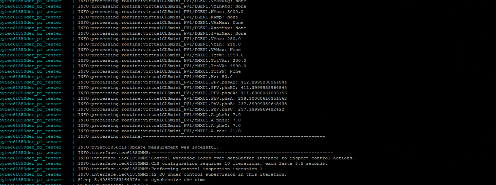

## Build the project as a single docker container on Raspberry Pi (64-bit)
The process is similar to the previous part, while one must firstly install docker on pi and clone the git project there. To configure a 64-bit Raspberry Pi 4/5 into an IEC 61850 compliant IED, make sure the Pi has Internet access and do the following:

1. install the Pi OS, check it out here if you have no idea how to do this: 

    https://www.raspberrypi.com/documentation/computers/getting-started.html

2. Use SSH tools and your username + password to login onto Pi

    To exchange files with SSH terminal, you can always use this command in windows CMD or windows powershell:

    `scp <path of local file> <pi username>@<pi IP>:~<dest path>`

3. Do the following to setup docker on Pi:

    1) update and install some basic packages, depending on the OS, you may have to always add sudo to each command 
    
           sudo apt update
           sudo apt upgrade
           apt-get install nano
           apt-get Install docker-compose

    2) download docker

           curl -sSL https://get.docker.com | sh  

    3) add current user to the group "docker"

           sudo usermod -aG docker $USER  
    
    4) To test the docker installation:

           docker run hello-world

    Ref: https://pimylifeup.com/raspberry-pi-docker/

4. Now that docker is ready to use, we can proceed to cloning the pyiec61850der project from git (you may have to install the git certificate first):

   0) install git certificate by copying your pem or crt certs onto pi, in the sub-folder `etc/ssl/certs`

           cp ~/your-cert.pem /usr/local/share/ca-certificates
    
           update-ca-certificates

   1) fetch git project (you may have to enter git username and password)

           git clone <url of the git project>

   2) navigate to the "root" directory of the project

           cd pyiec61850der/pyiec61850der

   3) change OS in Dockerfile

           nano container/build/linux/Dockerfile

   on line 6: change `ARG OS_VERSION=linux_amd64` -> `ARG OS_VERSION=linux_arm64`

   4) Check influxdb secret (access credentials and bucket names)
   if you use influxdb as data source or data endpoint, modify the configuration according to your application. 

           nano secret/influxdb.json

   If influxdb.json is not available, use the file influxdb_template.json and update the entries.
    
   5) check the config in the yaml file 
   
   Either use the file in ./configurator or in ./tester, e.g.

           nano tester/func_tests/config_tester.yaml
    
   espeically when you want to activate the sunspec interface for PV inverters, modify the entires under PV1 (IP, slave ID, TCP port)

   _**Attention, the PV inverter and raspberry pi must be in the same network to start a SunSpec communication!**_
    
   6) Check configuration for IEC 61850 data sources
   
   Also check the CSV lookup table to make sure that all data sources are properly configured as expected, e.g.
                
           nano tester/func_tests/IEC61850_DA_lookup_tester_DER_mini.csv

   it is a bad idea to edit the CSV file here, you'd better use a more efficient CSV viewer to edit and later copy the file back

   7) check the docker-compose file, then copy it to project root. If you are going to build a single docker 
      container on a linux device like raspberry Pi, and your container surely will not have any file confliction with 
      other applications, then it is suggested to use the other docker-compose file `docker-compose_mount.yml`. This 
      allows the docker to mount files on host device onto the working repository inside the container, these files 
      can be modified directly on the hose device and the docker container will get updates after a restart. Chances 
      are that some local files might get overwritten by the container.

           nano container/build/linux/docker-compose.yml

           cp container/build/linux/docker-compose.yml .

   8) clean up old containers
   
   In case you are reconfiguring the docker container, before you start a new container.
    
   List all active containers:

           docker ps- a

           docker image list

   Make sure that the old container and image with the same name has been removed using:

           docker rm <container id>

   and

           docker image rm <container id>

   9) Start the container

   After all the prep work above is done, start your container with:

           docker-compose up

   If you prefer to run the task in detach mode (i.e. do not stay in the container bash terminal after starting the container), just add "-d" to the command:

           docker-compose up -d

   You might want to set a appropriate --log-level to get rid of DEBUG log overflow.
           
           docker-compose --log-level INFO up -d

   If not in a detach mode, you would have to kill the entire pyiec61850der process when using Ctrl +C to exit the terminal.

   10) Play around with a running container
   
   In case you want to bash into the terminal of a running container, to inspect things or make modifications without having to kill the process, do this:
    
           docker exec -it <container name> /bin/bash
   
   or just 

           docker exec -it <container name> bash
   
   Docker exec opens a new tty process, therefore you can exit it by entering "exit" on command line, the original container process in detach mode will not be affected.

   To attach to a running container, do this:

           docker attach <container name>

   This allows you to enter the same tty process as the container and see all terminal outputs. To exit the attach mode, use Ctrl + P then Ctrl + Q, Ctrl + C will kill that container process as well. Sometimes Ctrl + P then Ctrl + Q won't work, in that case you might have to use this command instead:

           docker attach --sig-proxy=false <container name>
   
   Then you can exit with Ctrl + C without having to kill the container process.

   If you just want to see the logs, try this:

           docker logs -f <container name>

   You can exit the log tail by hitting Ctrl + C.

   To inspect the docker container configurations, do this:

           docker container inspect <container name>

   11) Connect pi to a sunspec compliant PV inverter

   As mentioned in step 5), you may have to send the raspberry pi in another network where the PV inverter is located. Make sure that parameters for the sunspec interface is properly configured. Just SSH back onto the pi again, stop the running container we have created, and use the command in step 9) to restart it.

    If thing went well, you would be able to see something like this in the pi SSH terminal.

    
   

   12) Modify files in a running container (if not mounting local directories)

   To some extent, one needs to modify one file or several files of a docker application, probably due to software update. If the pi has Internet access, this step can be done by cloning the up-to-date git project and repeating steps 1)-11) above.

   If the pi does not have a connection to the git server, or you would like not to rebuild the entire project, then you may alternatively choose to transfer certain files locally via SSH. This composes two steps: step 1 -> copy the file from local machine to pi via SSH; step 2 -> copy the file on pi to the docker container.

   The following commands will do the job:

   First stop the running container:

           docker stop <container name>

   Copy a file from local machine to pi (using CMD or powershell):

           scp <path of local file> <pi username>@<pi IP>:~<dest path>
   
   Copy the same file from pi to the container (remember the default work dir is called /work here):

           docker cp <src-path> <container>:<dest-path>

   e.g.

           cd pyiec61850der/pyiec61850der
           docker cp main.py pyiec61850der_mini_tester:work/

   In the end, restart the docker-container as in step 9), for example in detach mode:

           docker-compose up -d
   
   Or detach mode forcing color log output:

           docker-compose --ansi=always up -d

   13) export/import of docker containers
    
   To use a prepared docker image in other linux systems, you can simply export and import the docker image,
   and later build a service using docker-compose and the same image(s) after the yml file and image(s) have
   been copied to the new device.

           docker export_compose_file <your image name>:<your image version> | gzip > ~/<export image name>.tar.gz
           docker load < <path on the other OS>/<export image name>.tar.gz

   e.g.

           docker export_compose_file pyiec61850der_cls_tester:1.0 | gzip > ~/docker_cls_image.tar.gz
           docker load < ~/docker_cls_image.tar.gz

   or use the save syntax

            docker save mega_sim_testing:1.0 > c:\mega_sim.tar

   If one linux device can only run offline, it is also possible to install and configure docker-compose in offline mode,
   for more information please refer to: https://muralitechblog.com/how-to-install-docker-compose-offline/

   Download the correct distribution: https://github.com/docker/compose/releases/tag/v2.27.1
